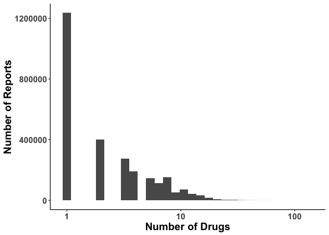
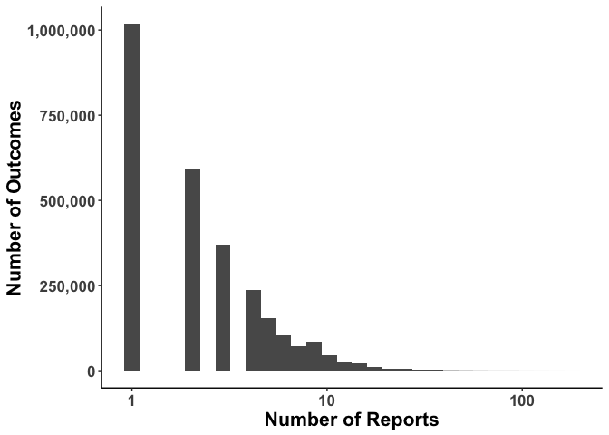
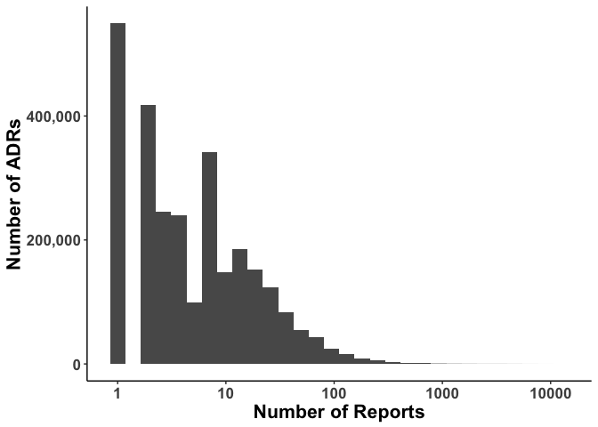
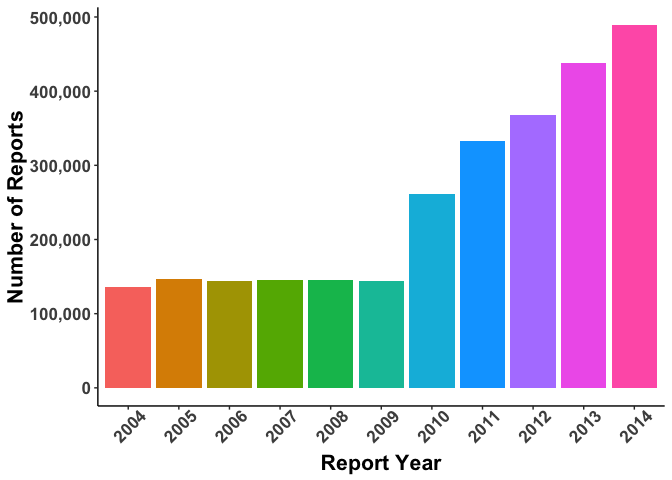
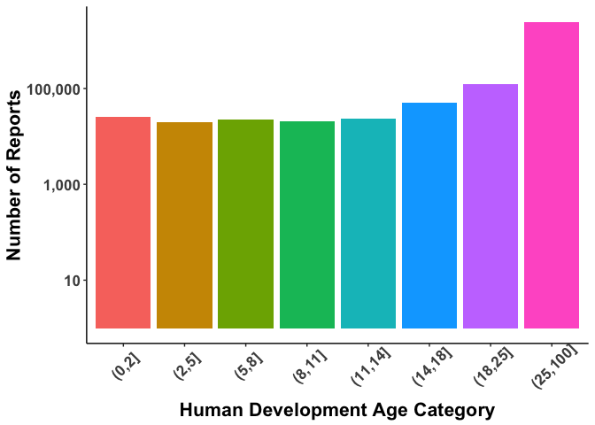
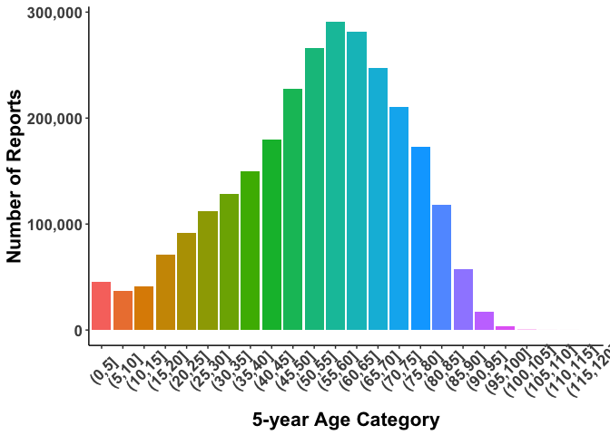
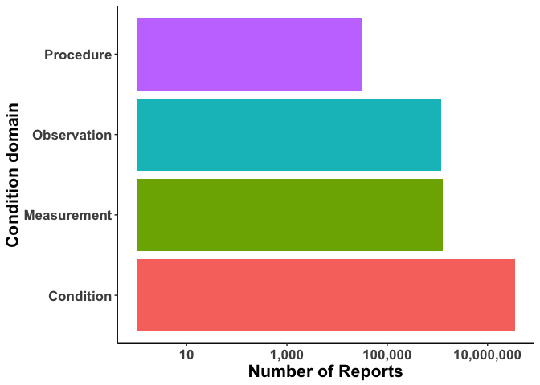
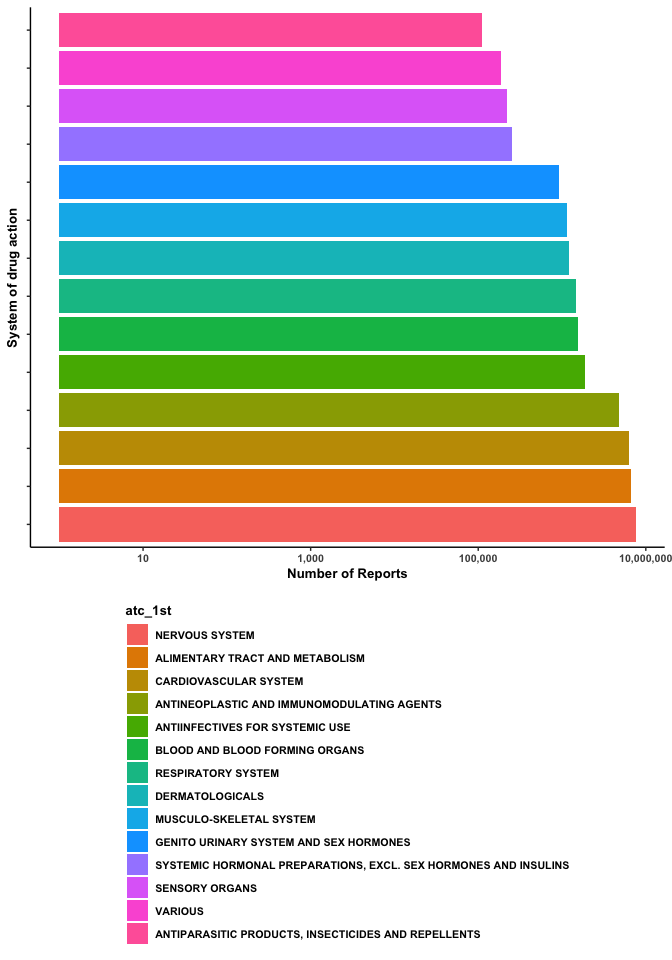

Introduction to AEOLUS dataset
================

## Brief Introduction


``` r
library(fst)
library(data.table)
library(tidyverse)

theme_set(theme_classic())

data_dir <- "../data/"
aeolus <- read_fst(paste0(data_dir,"aeolus.fst"),as.data.table = T)
```

## Brief Introduction

The Adverse Event Open Learning through Universal Standardization, or
AEOLUS, is detailed in the paper by [Banda et
al](http://www.nature.com/articles/sdata201626).

Briefly, it contains a standardized version of reports from the FDA’s
Adverse Event Reporting System, allowing for efficient and reproducible
analyses of ADEs.

The aeolus dataset has 38,065,726 rows with 2,748,714 unique reports.

Below, I briefly show characteristics of this dataset.

## Table display

``` r
aeolus[1:10]
```

    ##           id master_age deceased age_code gender_code report_year
    ##  1: 77122895      77.70    FALSE       YR           F        2012
    ##  2: 92663843      79.00    FALSE       YR           M        2013
    ##  3: 94648863      66.29    FALSE       YR           F        2013
    ##  4:  4440060      78.00    FALSE       YR           M        2004
    ##  5:  4456349      60.00    FALSE       YR           M        2004
    ##  6:  5148155      46.00    FALSE       YR           M        2006
    ##  7:  6684617      55.00    FALSE       YR           F        2010
    ##  8: 94304654      72.81    FALSE       YR           M        2013
    ##  9: 94524951      81.00    FALSE       YR           M        2013
    ## 10:  8249307      46.00    FALSE       YR           F        2012
    ##     drug_concept_id outcome_concept_id dev_age_cat age_cat atc_1st atc_2nd
    ##  1:        19097016             316866    (25,100] (75,80]    <NA>    <NA>
    ##  2:        19097016             316866    (25,100] (75,80]    <NA>    <NA>
    ##  3:        19097016             316866    (25,100] (65,70]    <NA>    <NA>
    ##  4:        19097016             316866    (25,100] (75,80]    <NA>    <NA>
    ##  5:        19097016             316866    (25,100] (55,60]    <NA>    <NA>
    ##  6:        19097016             316866    (25,100] (45,50]    <NA>    <NA>
    ##  7:        19097016             316866    (25,100] (50,55]    <NA>    <NA>
    ##  8:        19097016             439977    (25,100] (70,75]    <NA>    <NA>
    ##  9:        19097016            4110705    (25,100] (80,85]    <NA>    <NA>
    ## 10:        19097029            4184746    (25,100] (45,50]    <NA>    <NA>
    ##     atc_3rd atc_4th outcome_domain_id               drug_concept_name
    ##  1:    <NA>    <NA>         Condition CALCIUM CARBONATE, PRECIPITATED
    ##  2:    <NA>    <NA>         Condition CALCIUM CARBONATE, PRECIPITATED
    ##  3:    <NA>    <NA>         Condition CALCIUM CARBONATE, PRECIPITATED
    ##  4:    <NA>    <NA>         Condition CALCIUM CARBONATE, PRECIPITATED
    ##  5:    <NA>    <NA>         Condition CALCIUM CARBONATE, PRECIPITATED
    ##  6:    <NA>    <NA>         Condition CALCIUM CARBONATE, PRECIPITATED
    ##  7:    <NA>    <NA>         Condition CALCIUM CARBONATE, PRECIPITATED
    ##  8:    <NA>    <NA>         Condition CALCIUM CARBONATE, PRECIPITATED
    ##  9:    <NA>    <NA>         Condition CALCIUM CARBONATE, PRECIPITATED
    ## 10:    <NA>    <NA>         Condition              Mixed vespid venom
    ##                          outcome_concept_name
    ##  1:                     Hypertensive disorder
    ##  2:                     Hypertensive disorder
    ##  3:                     Hypertensive disorder
    ##  4:                     Hypertensive disorder
    ##  5:                     Hypertensive disorder
    ##  6:                     Hypertensive disorder
    ##  7:                     Hypertensive disorder
    ##  8: Poisoning by analgesic AND/OR antipyretic
    ##  9:           Squamous cell carcinoma of lung
    ## 10:              Left ventricular hypertrophy
    ##                                                             drug_outcome_name
    ##  1:                     CALCIUM CARBONATE, PRECIPITATED_Hypertensive disorder
    ##  2:                     CALCIUM CARBONATE, PRECIPITATED_Hypertensive disorder
    ##  3:                     CALCIUM CARBONATE, PRECIPITATED_Hypertensive disorder
    ##  4:                     CALCIUM CARBONATE, PRECIPITATED_Hypertensive disorder
    ##  5:                     CALCIUM CARBONATE, PRECIPITATED_Hypertensive disorder
    ##  6:                     CALCIUM CARBONATE, PRECIPITATED_Hypertensive disorder
    ##  7:                     CALCIUM CARBONATE, PRECIPITATED_Hypertensive disorder
    ##  8: CALCIUM CARBONATE, PRECIPITATED_Poisoning by analgesic AND/OR antipyretic
    ##  9:           CALCIUM CARBONATE, PRECIPITATED_Squamous cell carcinoma of lung
    ## 10:                           Mixed vespid venom_Left ventricular hypertrophy

## Number of drugs reported per report

``` r
unique(aeolus[,.(id,drug_concept_id)])[
  ,.N,by=id
][
  order(-N)
] %>% 
  ggplot(aes(N)) +
  geom_histogram() +
  scale_x_log10() +
  theme(
    text = element_text(face="bold",size=16)
  ) +
  ylab("Number of Reports") +
  xlab("Number of Drugs")
```

<!-- -->

## Number of outcomes reported per report

``` r
unique(aeolus[,.(id,outcome_concept_id)])[
  ,.N,by=id
][
  order(-N)
] %>% 
  ggplot(aes(N)) +
  geom_histogram() +
  scale_x_log10() +
  scale_y_continuous(labels = scales::comma) + 
  xlab("Number of Reports") +
  ylab("Number of Outcomes") +
  theme(
    text = element_text(face="bold",size=16)
  )
```

<!-- -->

## Number of ADRs reported

``` r
unique(aeolus[,.(id,drug_concept_id,outcome_concept_id)])[
  ,.N,by=id
][
  order(-N)
] %>% 
  ggplot(aes(N)) +
  geom_histogram() +
  scale_x_log10() +
  scale_y_continuous(labels = scales::comma) + 
  xlab("Number of Reports") +
  ylab("Number of ADRs") +
  theme(
    text = element_text(face="bold",size=16)
  )
```

<!-- -->

## Number of reports per year

``` r
unique(aeolus[,.(id,report_year)])[
  ,.N,by=report_year
][
  order(report_year)
][
  ,.(report_year = as.character(report_year),
     N)
] %>% 
  ggplot(aes(report_year,N,fill=report_year)) +
  geom_bar(stat="identity") +
  scale_y_continuous(labels = scales::comma) + 
  xlab("Report Year") +
  ylab("Number of Reports") +
  theme(
    axis.text.x = element_text(angle=45,vjust=0.7),
    text = element_text(face="bold",size=16),
    legend.position = "none"
  )
```

<!-- -->

## Number of reports per age category

``` r
data <- na.omit(
  unique(
    aeolus[,.(id,dev_age_cat)]
    )[
  ,.N,by=dev_age_cat
  ]
)[
  order(dev_age_cat)
][
  ,.(dev_age_cat = as.character(dev_age_cat),
     N)
] 

age_cats <- as.character(unique(data[,dev_age_cat]))
ord <- order(sapply(strsplit(age_cats,"[\\[(]"),function(x){strsplit(x[2],",")[[1]][1]}) %>% as.integer())
seq_age_cats <- age_cats[ord]

data$dev_age_cat <- factor(data$dev_age_cat,levels=seq_age_cats)


data %>% 
  ggplot(aes(dev_age_cat,N,fill=dev_age_cat)) +
  geom_bar(stat="identity") +
  scale_y_continuous(trans="log10",labels = scales::comma) + 
  xlab("Human Development Age Category") +
  ylab("Number of Reports") +
  theme(
    axis.text.x = element_text(angle=45,vjust=0.7),
    text = element_text(face="bold",size=16),
    legend.position = "none"
  )
```

<!-- -->

``` r
data <- na.omit(
  unique(
    aeolus[,.(id,age_cat)]
    )[
  ,.N,by=age_cat
  ]
)[
  ,.(age_cat = as.character(age_cat),
     N)
]

age_cats <- as.character(unique(data[,age_cat]))
ord <- order(sapply(strsplit(age_cats,"[\\[(]"),function(x){strsplit(x[2],",")[[1]][1]}) %>% as.integer())
seq_age_cats <- age_cats[ord]

data$age_cat <- factor(data$age_cat,levels=seq_age_cats)

data %>% 
  ggplot(aes(age_cat,N,fill=age_cat)) +
  geom_bar(stat="identity") +
  scale_y_continuous(labels = scales::comma) + 
  xlab("5-year Age Category") +
  ylab("Number of Reports") +
  theme(
    axis.text.x = element_text(angle=45,vjust=0.7),
    text = element_text(face="bold",size=16),
    legend.position = "none"
  )
```

<!-- -->

## Condition types

``` r
aeolus[
  ,.(id,outcome_domain_id)
  ][
    ,.N,
    by=outcome_domain_id
  ][
    order(-N)
  ] %>% 
  ggplot(aes(outcome_domain_id,N,fill=outcome_domain_id)) +
  geom_bar(stat="identity") +
  scale_y_continuous(trans="log10",labels=scales::comma) +
  coord_flip() +
  ylab("Number of Reports") +
  xlab("Condition domain") +
  theme(
    legend.position = "none",
    text = element_text(face="bold",size=16)
  )
```

<!-- -->

## ATC 1st distribution of drugs

``` r
df <- aeolus[!is.na(atc_1st),
       .(id,atc_1st)][
         ,.N,
         by=atc_1st
       ][
         order(-N)
       ]

df$atc_1st <- factor(df$atc_1st,levels=unique(df$atc_1st))

df %>% 
  ggplot(aes(atc_1st,N,fill=atc_1st)) +
  geom_bar(stat="identity") +
  scale_y_continuous(trans="log10",labels=scales::comma) +
  coord_flip() +
  xlab("System of drug action") +
  ylab("Number of Reports") + 
  guides(
    fill=guide_legend(
      ncol = 1,
      title.position = "top")
    ) +
  theme(
    legend.position = "bottom",
    axis.text.y = element_text(size=0),
    text = element_text(face="bold",size=10)
  )
```

<!-- -->
